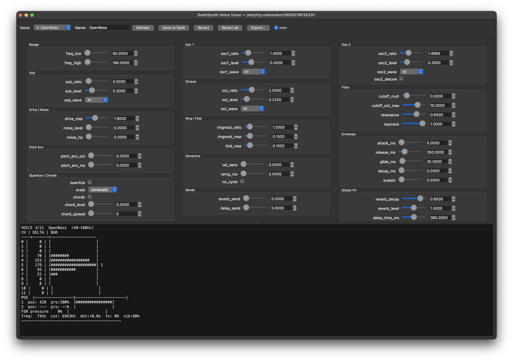

# Glass Touch Bass Synth
### Daisy Seed · MPR121 · Bit-Bang I2C · C++

A capacitive touch synthesiser played through a glass surface. One or two fingers control pitch, filter, distortion and detune in real time. Built on the Daisy Seed embedded audio platform using a custom bit-bang I2C driver and a software touch tracker with centroid position interpolation.

---

## Hardware

| Component | Detail |
|---|---|
| MCU / Audio | Daisy Seed (STM32H750, 480 MHz, 24-bit 48 kHz) |
| Touch sensor | MPR121 capacitive touch controller (12 electrodes) |
| Interface | Glass surface over bare copper electrodes |
| SDA pin | D12 (PB8) — 4.7 kΩ pull-up to 3.3 V |
| SCL pin | D11 (PB9) — 4.7 kΩ pull-up to 3.3 V |
| MPR121 address | 0x5A (ADDR pin → GND) |
| Audio out | Headphone jack — both channels carry the same mono signal |

### Wiring

```
Daisy D12 ──┬── MPR121 SDA
            └── 4.7kΩ ── 3V3

Daisy D11 ──┬── MPR121 SCL
            └── 4.7kΩ ── 3V3

Daisy 3V3 ──── MPR121 VCC
Daisy GND  ──── MPR121 GND
                MPR121 ADDR → GND   (sets address 0x5A)
```

> **Note on jack wiring:** Use a TRS (stereo, 3-pole) jack. A TS (mono, 2-pole) jack will short the right channel to ground when a TRS headphone plug is fully inserted.

---

## Building

Requires [libDaisy](https://github.com/electro-smith/libDaisy) and the Daisy toolchain.

```bash
# Set LIBDAISY to wherever libDaisy lives on your machine
LIBDAISY=/path/to/libDaisy

# Build the synth
make TARGET=src/main libdaisy_dir=$LIBDAISY SYSTEM_FILES_DIR=$LIBDAISY/core LIBDAISY_DIR=$LIBDAISY

# Flash via USB DFU (hold BOOT, tap RESET, then run):
dfu-util -a 0 -s 0x08000000:leave -D build/src/main.bin
```

To build a diagnostic tool instead:

```bash
make TARGET=tools/test-slider ...same flags...
dfu-util -a 0 -s 0x08000000:leave -D build/tools/test-slider.bin
```

---

## Files

| File | Purpose |
|---|---|
| `src/main.cpp` | Main synth — touch tracker + audio engine |
| `tools/voicelab_gui.py` | **Voice tuner GUI** (PySide6) — reshape the active voice live over USB, export to C++ |
| `tools/voicelab.py` | Voice tuner CLI (REPL) — same, from the terminal |
| `tools/galetsynth/` | Shared Python core for the tuners (serial link, field schema, C++ exporter) |
| `tools/test-slider.cpp` | Live sensor display — delta bars, position and pressure (no audio) |
| `tools/mpr121_calibrate.cpp` | Full AFE + per-electrode pressure calibration tool |
| `tools/mpr121_reader.cpp` | Debug tool — shows raw electrode data and deltas |
| `tools/i2c_scanner.cpp` | Scans I2C bus and finds MPR121 address |
| `tools/osc_test.cpp` | Minimal sine oscillator — confirms audio output works |
| `tools/mpr121_glass_tuner.cpp` | Sweeps CDC/CDT settings, finds best config for glass |
| `tools/mpr121_glass_tuner2.cpp` | Phase 2 tuner — sweeps FFI and ESI settings |

---

## Playing

On boot you will hear a short beep confirming audio is working. The serial monitor then shows electrode data and finger positions.

**Finger 1** controls the main voice:
- **Position** (left → right) — pitch across the active voice's range (e.g. 50–300 Hz for `VOICE_LEAD`), continuous, with optional quantise-on-touch-down
- **Pressure** — opens the low-pass filter from dark/closed to wide open; also adds vibrato and drive at high pressure

**Finger 2** adds timbre modulation:
- **Position** — on voices with `osc2_detune` (e.g. `VOICE_LEAD`), detunes the second oscillator (left = flat, centre = unison, right = sharp); on the others osc2 holds a fixed interval (e.g. a perfect 5th) so position is unused
- **Pressure** — adds wavefold distortion and, above ~85%, ring modulation (amounts capped per voice by `fold_max` / `ringmod_max`)

The exact character — range, waveforms, filter, drive, effects, envelope — depends on the active **Voice** (see below).

**Calibration:** keep fingers off the glass for 2 seconds after power-on — the baseline is captured automatically. It recaptures every 2 seconds of idle time to compensate for drift.

---

## Voices

The whole sound is defined by a **Voice** — one `Voice` struct holding the
oscillator stack, filter character, drive, effect amounts and envelope. The
firmware ships several presets in a `VOICES[]` bank and switches between them
**live** (see the gesture below); `g_voice_idx` selects the boot voice:

```cpp
static constexpr Voice VOICES[] = { VOICE_LEAD, VOICE_BASS, /* … */, VOICE_DRUMS };
static volatile int    g_voice_idx = 2;  // ← boot voice (index into VOICES[]; 2 = OpenBass)
```

| # | Preset | Character |
|---|---|---|
| 1 | `VOICE_LEAD` | Glass-Moog lead — triangle oscillators, finger-2 detune, expressive |
| 2 | `VOICE_BASS` | Round, dark power chord (osc2 = fixed perfect 5th → root + 5th + octave + sub) |
| 3 | `VOICE_BASS_OPEN` | Same chord stack, brighter base and a wider pressure sweep |
| 4 | `VOICE_BASS_RICH` | Mixed saw/square/sine waveforms, dark base, huge acid-style filter sweep |
| 5 | `VOICE_ORGAN` | Clean all-sine organ/flute, higher register, slow chorus shimmer, breath noise — plus a roomy **reverb + delay** wash (the test voice for the shared effects) |
| 6 | `VOICE_SCREAM` | Aggressive detuned saws, heavy drive, near-self-oscillating resonance, inharmonic metallic ring-mod |
| 7 | `VOICE_GUITAR` | Electric guitar power chord — driven saw stack (root + fixed 5th + octave), **quantized to major**, fast pluck attack + amp **decay-to-silence** (~1.2 s) so it plucks and rings out |
| 8 | `VOICE_PAD` | Warm ensemble pad — detuned saws + sine top, dark filter, very slow swell and long tail |
| 9 | `VOICE_TOM` | Noise-driven percussion — **tap to play**; dark/round tom with a pitch-drop, tunes 40–400 Hz |
| 10 | `VOICE_KICK` | **Tap** — deep punchy kick, low sine + a 2-octave pitch "boom", very closed; tunes 30–80 Hz |
| 11 | `VOICE_SNARE` | **Tap** — bright noisy rattle + tonal body, quick pitch snap, open filter; tunes 150–500 Hz |
| 12 | `VOICE_HIHAT` | **Tap** — crisp high "tsss" from high-passed noise + a metallic edge, short sizzle tail |
| 13 | `VOICE_SH101` | SH-101-style synth ("SH-101 min") — saw + unison square over a square sub one octave down, resonant ladder swept by pressure for the squelchy acid "wow", portamento glide. **Plays 3-note diatonic triads** (`chords`) quantized to a minor scale — each tap is a root + 3rd + 5th in key; slides bend the whole chord |
| 14 | `VOICE_SH101_MAJ` | "SH-101 maj" — same synth, but its triads quantize to a **major** scale (bright I/ii/iii… chords). Cycle here to switch the chord flavor live |
| 15 | `VOICE_DRUMS` | **MultiVoice** — the glass becomes a 4-zone drum kit (see below) |

> The four raw drums (Tom/Kick/Snare/Hi-Hat) and the others are all in the bank,
> but the live-switch **cycle** skips the raw drums (`no_cycle`) — you reach them
> only as the boot voice or through the Drums MultiVoice. So the gesture steps
> through the **10 melodic instruments + Drums**. The two `VOICE_SH101` twins sit
> after the raw drums in the bank (keeping their indices, and `MULTI_ZONES`,
> stable) but are cyclable — they appear right after Pad in the cycle.

**Switching voices live — FSR-hold + tap-the-glass gesture:** a three-phase move:

1. **Enter** — press the FSR **fully to the mute floor** while **not touching the
   glass** for **2 seconds**. (Requiring no touch is deliberate: a hard press
   alone is just "muted", so the no-touch condition keeps normal muting from
   tripping select.) The LEDs blink the current voice's cycle position.
2. **Advance / preview** — with the FSR **still held**, each **tap on the glass**
   steps to the next cyclable voice, **wrapping** after the last; a single LED
   blink marks each change. If voice-preview is enabled (`VOICE_PREVIEW_ENABLED`),
   the selected mono voice then plays live through the real note path driven by
   your actual pressure + position — slide for pitch, press for the filter sweep.
   The **Drums** kit instead fires a canned kick + snare "one-two".
3. **Keep** — **release the FSR** → the selected voice is **saved to QSPI flash**
   (so it survives a power-cycle) and you exit immediately; the saved voice's
   number then blinks non-blocking so you can start playing right away.

The cycle **skips voices flagged `no_cycle`** — the four raw drums are excluded
(you play them via the Drums MultiVoice), so the gesture steps through the
melodic instruments + Drums. To change the **boot** voice edit the `g_voice_idx`
initializer; to change cycle order or membership reorder `VOICES[]` or flip
`no_cycle`.

Each voice controls, per oscillator: pitch ratio, mix level and **waveform**
(`WAVE_TRI` / `WAVE_SINE` / `WAVE_SQUARE` / `WAVE_SAW`); plus filter base cutoff,
sweep depth, resonance, **keytracking**, drive, **noise** (white or high-passed
"tsss"), **ring-mod carrier ratio** and ceilings, a **pitch envelope** (the
drop/“boom” at note onset), **velocity sensitivity** (`vel_sens` — tap strength
→ loudness, for dynamic drumming), and per-voice **attack / release / glide** (in ms).
The noise + short envelopes + pitch envelope are what make the tap-to-play
percussion voices (Kick/Snare/Tom/Hi-Hat). To add a voice, copy a `VOICE_*`
block, retune, and add it to `VOICES[]`. Full reference: `CLAUDE.md` → *Voices*.

### MultiVoice — "Drums" (4-voice polyphonic kit)

`VOICE_DRUMS` turns the glass into a **4-zone drum kit you can play with up to 4
fingers at once** (kick + snare + hat together). Each zone triggers one drum on
tap, and the fine position within a zone snaps the pitch to an interval:

```
|  KICK   |  SNARE  |   TOM   |   HAT   |   ← four equal zones, left to right
|root 4 5 8|...      |...      |...      |   ← fine position snaps to root/4th/5th/octave
```

Each finger drives its own independent drum voice (own oscillators, filter and
envelopes), so hits overlap and ring freely. Playing:

- **Tap** a zone for a hit — tap as fast as you like, **no rate limit**.
- **Velocity**: `FIX_DRUM` (default on) makes every tap a consistent full hit;
  turn it off for pressure-velocity dynamics (`vel_sens`).
- **Hold + bounce**: while a finger stays down, a deliberate pressure pulse
  re-attacks, rate-limited per drum by `retrig_ms` (a steady hold stays quiet).

The zone-to-drum map (`MULTI_ZONES[]`), intervals (`MULTI_INTERVALS[]`),
`FIX_DRUM`, and each drum's `retrig_ms` are all editable near the top of
`src/main.cpp`. Other voices remain monophonic.

> The parameter sections below describe the **DSP mechanics** and the default
> (`VOICE_LEAD`) values. The specific numbers — oscillator levels/waveforms,
> cutoff base/sweep, resonance, drive, detune/fold/ring-mod amounts, attack,
> release and glide — are now **per-voice fields**, not global constants.

---

## Signal Chain

```
Osc 1  (root,         per-voice wave)  × osc1_level
Osc 2  (5th / detune, per-voice wave)  × osc2_level   ← fixed ratio, or finger-2 detune
Sub    (octave below, per-voice wave)  × sub_level
Osc Oct (octave above, per-voice wave) × oct_level
Noise  (white)                          × noise_level
         │
         ▼
    Oscillator mix
         │
    Ring modulator  ← finger 2 extreme pressure (carrier = ringmod_ratio × freq)
         │
    Waveshaper (fast_tanh drive)  ← finger 1 pressure × drive_max
         │
    Moog 4-pole ladder filter  ← finger 1 pressure (exponential cutoff sweep, keytracked)
         │
    Wavefold distortion  ← finger 2 pressure × fold_max
         │
    Output soft clip (fast_tanh × 1.3)
         │
    Amplitude envelope  (per-voice attack_ms / release_ms)
         │
    Reverb + Delay  ← parallel per-voice aux sends (reverb_send / delay_send)
         │            into one shared reverb + one shared delay; global
         │            tail/time/feedback/level (g_reverb_* / g_delay_*)
         │
    L + R out (identical / mono)
```

---

## Touch Detection Parameters

These constants at the top of the file control touch sensitivity and finger tracking.

```cpp
static constexpr int32_t  TOUCH_THRESHOLD    = 10;
```
Minimum capacitance delta (counts) to register a touch. **Raise** if you get false triggers from vibration or electrical noise. **Lower** if touches are not detected reliably. Range: typically 5–20 for glass surfaces. Current value: **10** (tuned for 3mm soda-lime glass).

```cpp
static constexpr int32_t  PRESSURE_MAX_REF[12] = {
    42,35,34,34,34,34,
    34,34,33,32,29,30
};
```
Per-electrode delta count that maps to 100% pressure. Pressure is scaled over the
range `[TOUCH_THRESHOLD .. PRESSURE_MAX_REF[ch]]`, so a touch reads 0% at the
touch threshold and 100% at this peak. Edge channels are tuned slightly higher
because they naturally produce larger deltas. Tune each entry by pressing firmly
on that electrode and noting the peak delta in `tools/test-slider`.

```cpp
static constexpr bool QUANTIZE_ENABLED = true;
```
When `true`, touch-down snaps to the nearest note in `SCALE[]`. Once sliding, pitch follows the finger continuously. Set to `false` for fully continuous pitch from first contact — no snapping at all.

```cpp
static constexpr int32_t  MIN_FINGER_SEP     = 4;
```
Minimum electrode separation required to recognise a second finger. Prevents a single wide finger blob from being misread as two fingers.

```cpp
static constexpr uint32_t REBASELINE_IDLE_MS = 2000;
```
Milliseconds of no touch before the baseline is automatically recaptured. Lower values adapt faster to temperature/humidity drift but may interrupt playing. 2000–5000 ms is a good range.

```cpp
static constexpr int32_t  MAX_POS_JUMP       = 200;
```
Maximum position change (0–1000 scale) per frame to maintain finger identity. If a finger "teleports" further than this it is treated as a new finger. Lower values make tracking more stable; higher values allow faster sliding.

```cpp
static constexpr int      REBASELINE_SAMPLES = 32;
```
Number of electrode readings averaged for each baseline capture. Higher = more accurate baseline, longer calibration pause.

---

## Musical Mapping

```cpp
float freq_low;        // Hz at electrode 0 (left)  — per-voice
float freq_high;       // Hz at electrode 11 (right) — per-voice
float log_freq_ratio;  // = ln(freq_high / freq_low), precomputed
```
Frequency range of the instrument, **per voice** (`VOICE_BASS` is 40–160 Hz,
`VOICE_ORGAN` 65–520 Hz, `VOICE_SCREAM` 90–720 Hz, …). The mapping is
**exponential** (equal musical intervals per unit of travel), so the spacing
feels even as you slide. `log_freq_ratio` is the precomputed `ln(high/low)` used
by the mapping (`logf` isn't `constexpr`), so keep it in sync if you change the
range.

```cpp
static const int SCALE[] = {0,1,2,3,4,5,6,7,8,9,10,11}; // chromatic
```
Scale used for note quantisation on touch-down. Change this array to restrict to a specific scale:

| Scale | Array |
|---|---|
| Chromatic (default) | `{0,1,2,3,4,5,6,7,8,9,10,11}` |
| Major | `{0,2,4,5,7,9,11}` |
| Natural minor | `{0,2,3,5,7,8,10}` |
| Pentatonic major | `{0,2,4,7,9}` |
| Pentatonic minor | `{0,3,5,7,10}` |
| Blues | `{0,3,5,6,7,10}` |
| Dorian | `{0,2,3,5,7,9,10}` |

After quantising on touch-down, sliding the finger continuously tracks the raw position — giving you glide and expression within a note.

---

## Envelope Parameters

The amplitude envelope and pitch glide are **per-voice**, specified in
milliseconds and converted to slew coefficients once at startup
(`ms_to_coeff`). They live in the `Voice` struct, not as global constants:

```cpp
float attack_ms;    // amp attack  — low = percussive, high = organ-like fade-in
float release_ms;   // amp release — how long the note sustains after lift-off
float glide_ms;     // portamento  — pitch glide time between notes
```

Rough feel: `attack_ms` 2–10 ms is snappy/plucky, 20–50 ms is soft;
`release_ms` 100–300 ms is tight, 500 ms+ leaves a long tail; `glide_ms` ~8 ms
feels immediate (organ), ~40 ms gives smooth lead slides. Very short attacks
(<1 ms) can click. Per-voice values are listed in each `VOICE_*` block.

---

## Filter Parameters

The cutoff is a Moog 4-pole ladder swept by finger-1 pressure. Its shape is set
by per-voice fields:

```cpp
float cutoff_oct = VOICE.cutoff_oct_max * prs_cut;            // octaves of sweep
float track_freq = freq;                                     // scaled by VOICE.keytrack
float cutoff     = clampf(track_freq * VOICE.cutoff_mult * oct_mult, 20.0f, 18000.0f);
float filtered   = moog(mix, eff_cutoff, VOICE.resonance, sr);
```

- **`cutoff_mult`** — base cutoff relative to the (keytracked) note. `0.25` very
  dark, `0.5`+ brighter at rest, `~1.0` sits right on the fundamental (muffled).
- **`cutoff_oct_max`** — total sweep in octaves. `2` barely opens (closed bass);
  `13` is an explosive acid sweep. Practical ceiling ~14 before instability.
- **`resonance`** — ladder Q. `0.3` smooth/warm, `0.75` very vocal, `~0.9`
  whistles near self-oscillation (scream).
- **`keytrack`** (0..1) — how much the cutoff base follows pitch. `1.0` = full
  tracking; lower values hold the cutoff down as you play higher, for a more
  consistent tone across the range.

The pressure→cutoff curve itself is a fixed `smootherstep` (6x⁵−15x⁴+10x³) —
dark at low pressure, steep through the middle, easing at the top.

---

## Oscillator Mix

Each oscillator's level, pitch ratio and **waveform** are per-voice fields; the
audio engine reads them from the active `VOICE`:

```cpp
float osc1    = osc(s_phase1,   VOICE.osc1_wave) * VOICE.osc1_level;   // root
float osc2    = osc(s_phase2,   VOICE.osc2_wave) * VOICE.osc2_level;   // 5th / detune
float sub     = osc(s_phase_sub,VOICE.sub_wave)  * VOICE.sub_level;    // octave below
float osc_oct = osc(s_phase_oct,VOICE.oct_wave)  * VOICE.oct_level;    // octave above
// + white noise × VOICE.noise_level
```

Keep the sum of the levels (the `VOICE_LEAD` default is 0.50 + 0.22 + 0.18 +
0.15 = 1.05) below ~1.2 to avoid driving the waveshaper too hard by default.

Oscillator frequencies = `freq_vib × ratio`:
- **osc1**: `osc1_ratio` (usually 1.0) + vibrato
- **osc2**: `osc2_ratio` — a fixed interval (e.g. `RATIO_FIFTH`, or a 1.005–1.008 chorus/scream detune), or finger-2 detune when `osc2_detune` is `true`
- **sub** / **osc_oct**: `sub_ratio` (0.5) / `oct_ratio` (2.0)
- **rm_carrier**: `ringmod_ratio × freq` (ring mod only; non-integer = bell/metallic)

---

## Finger 2 Effects

```cpp
float detune_pos  = (pos01 - 0.5f) * 3.0f;   // ±1.5 semitones
```
Maximum detune range. Finger 2 at centre = no detune. Left = flat, right = sharp. Range `3.0f` = ±1.5 semitones (subtle chorus). Raise to `12.0f` for a full ±6 semitone spread.

```cpp
float bc  = smootherstep2(ss3) * VOICE.fold_max;   // per-voice ceiling
```
Wavefold distortion maximum amount (`fold_max`). `0.15` = subtle warmth at
maximum pressure; `0.35` is audible grit, `0.60` heavy. `0.0` disables it. The
triple-smootherstep curve means the effect only arrives at high pressure
regardless of the ceiling.

```cpp
float rm = smoothstep2(rm_in) * VOICE.ringmod_max;   // per-voice ceiling
```
Ring modulation maximum wet level (`ringmod_max`). Only activates above 85%
finger-2 pressure. `0.15` is subtle; `0.40` is strongly metallic. The carrier
pitch is `ringmod_ratio × freq` — set it non-integer (e.g. `2.5`) for
inharmonic, clangorous bell tones (as `VOICE_SCREAM` does).

---

## Slew Rates Reference

All slew parameters use a one-pole lowpass form: `s = s × pole + target × (1 − pole)`. Higher pole value = slower response.

These remaining constants are **global** (shared by all voices):

| Constant | Value | Response | Controls |
|---|---|---|---|
| `SLEW_CUT` | 0.9994 | ~35 ms | Filter cutoff opening speed — smooths the stepped, integer-quantised pressure targets from the control loop |
| `SLEW_MISC` | 0.9900 | ~2 ms | Drive and vibrato |
| `SLEW_F2_A` | 0.9800 | ~10 ms | Finger 2 effect attack |
| `SLEW_F2_R` | 0.9990 | ~200 ms | Finger 2 effect release |

Pitch glide and the amplitude attack/release are now **per-voice** (`glide_ms`,
`attack_ms`, `release_ms`) rather than the former global `SLEW_FREQ` /
`SLEW_AMP_A` / `SLEW_AMP_R` — see [Voices](#voices) and Envelope Parameters.

---

## MPR121 AFE Configuration

These values were determined by the sensitivity sweep tools and tuned for 3 mm soda-lime glass.

```cpp
mpr_write(REG_CONFIG1, 0x50);  // FFI=10 iterations | CDC=16 µA charge current
mpr_write(REG_CONFIG2, 0x6C);  // CDT=16 µs charge time | SFI=18 iterations | ESI=1 ms
```

| Register | Bits | Value | Meaning |
|---|---|---|---|
| CONFIG1 `[7:6]` | FFI | 01 = 10 iters | First filter iterations — smoothing |
| CONFIG1 `[5:0]` | CDC | 010000 = 16 µA | Charge current — lower is better through glass |
| CONFIG2 `[6:4]` | CDT | 110 = 16 µs | Charge time — longer for glass dielectric |
| CONFIG2 `[3:2]` | SFI | 11 = 18 iters | Second filter iterations |
| CONFIG2 `[1:0]` | ESI | 00 = 1 ms | Electrode sample interval |

Touch threshold: **4** counts. Release threshold: **2** counts. (Default is 12/6 for bare electrode — glass requires lower thresholds.)

### Tuning for different glass

If signal is too weak (thin glass, bad contact): lower `TOUCH_THRESHOLD`, lower `PRESSURE_MAX_REF`, or try CDC=16µA with CDT=32µs (CONFIG2 = `0x7C`).

If signal is too noisy (false triggers): raise `TOUCH_THRESHOLD`, or switch to FFI=34 (CONFIG1 = `0xD0`).

---

## Serial Monitor Output

The main synth (`src/main.cpp`) does not print to serial during play — all serial output has been removed from the audio loop to keep touch polling fast.

Use `tools/test-slider` for live sensor monitoring. Flash it and open at 115200 baud — it refreshes at ~10 Hz:

```
 CH | DELTA | BAR
----+-------+--------------------
  0 |     0 | [                    ]
  5 |    18 | [################    ] 1
  6 |    12 | [###########         ]
 ...
 10 |    22 | [####################] 2
 11 |     8 | [#######             ]

POS  |----------1--------------------2----------|
  1  pos: 421  prs:  63%  [##########      ]
  2  pos: 834  prs:  41%  [######          ]
  freq:  97Hz  cut: 2840Hz  det:+0.8s  fx: 4%  vib: 0%
--------------------------------------------
```

- **CH**: Electrode number (0–11, left to right)
- **DELTA**: Capacitance change from baseline (counts). Resting = 0, touch = 10–35 through 3mm glass
- **BAR**: Visual bar scaled to the current peak delta. `1` / `2` marks the peak channel for each finger
- **POS**: Position track — `1` and `2` show finger positions across the slider range
- **pos**: Finger position 0–1000 (left to right)
- **prs**: Pressure 0–100% (sqrt-mapped from raw delta)
- **freq**: Current synthesised frequency in Hz
- **cut**: Current filter cutoff in Hz
- **det**: Osc 2 detune in semitones
- **fx**: Wavefold amount %
- **vib**: Vibrato depth %

---

## Troubleshooting

| Symptom | Likely cause | Fix |
|---|---|---|
| MPR121 not found at 0x5A | SDA/SCL swapped | Check D12=SDA, D11=SCL |
| MPR121 not found (scanner works) | Audio ISR interfering with I2C | Ensure MPR121 init is before `StartAudio()` |
| All deltas stuck at 0 | Wrong register address | Electrode data starts at 0x04, not 0x1C |
| Baseline much lower than raw | Baseline not settled | Increase post-init delay or use software baseline |
| Clicks on note start | Attack too fast | Raise the active voice's `attack_ms` (e.g. to 3–5 ms) |
| False touches at threshold 5 | Glass vibration noise | Raise `TOUCH_THRESHOLD` to 7–10 |
| Clicks on note end | Cutoff jumps on lift | Cutoff should track amplitude during release — check the release coupling code |
| False touches | Threshold too low | Raise `TOUCH_THRESHOLD` |
| Pressure always 0% | `PRESSURE_MAX_REF` too high | Lower to match real peak delta seen in monitor |
| Pressure always 100% | `PRESSURE_MAX_REF` too low | Raise to 2–3 counts above typical maximum |
| Two fingers not detected | Fingers too close | Need at least `MIN_FINGER_SEP` (4) channels of separation |
| Finger identity swaps | Fingers moving faster than `MAX_POS_JUMP` | Raise `MAX_POS_JUMP` |
| No audio | Codec not initialised | Ensure `hw.Init()` → MPR121 init → `hw.StartAudio()` order |
| Audio only on one side | TS jack with TRS plug | Use TRS jack or mono headphone |

---

## Live voice tuning

Design sounds on a laptop **against the real instrument** — tweak any parameter
and hear it on the glass instantly, then export the result as a C++ `Voice`.

```bash
python3 -m venv .venv && .venv/bin/pip install pyserial PySide6
.venv/bin/python tools/voicelab_gui.py      # GUI (auto-detects the Daisy port)
.venv/bin/python tools/voicelab.py          # or the terminal REPL
```



The firmware speaks a small line protocol over USB (`tune`/`set`/`select`/`dump`/
`mon`); while tuning it plays a mutable copy of the active voice so edits take
effect live. The GUI shows a slider/dropdown per field grouped into sections,
a voice picker, a live status dashboard (`mon`), and **Export** → a paste-ready
`static constexpr Voice VOICE_…{ }` block for `src/voice.h`. CLI and GUI share one
core (`tools/galetsynth/`), so the protocol, field model and exporter live in one
place. (Close any open `screen` first — the serial port is single-user.)

### Keep your edits — the persistent voice bank

Tuning is no longer throwaway. At boot the firmware copies the factory `VOICES[]`
into a mutable RAM bank (`g_bank[]`, in `src/persist.{h,cpp}`) — what the engine,
control loop and tuner all play — then overlays whatever was last saved to QSPI
flash. So a reshaped voice can be **kept across power cycles**, not just heard
while the laptop is attached.

- **Name** — rename a voice in the GUI's *Name* field (spaces allowed, e.g.
  "SH-101 min"); the picker labels follow the device's saved names.
- **Save to flash** — commits the live voice (parameters **and** name) into its
  bank slot and writes the bank to QSPI (only when something changed, to spare
  flash wear). It survives power-off.
- **Revert** / **Revert all** — restore one slot, or the whole bank, to the
  source defaults baked into `VOICES[]`.

The serial protocol gains matching verbs — `save`, `factory [all]`, `names`, and
`set name <text>` — and `dump` now reports the bank slot (`idx=`) so the host
stays in sync even after a rename. The GUI also reconnects automatically if the
synth is power-cycled mid-session, re-syncing to whatever voice it boots into.

### Back up & restore the whole bank (JSON)

- **Backup…** reads every editable slot off the synth (with a progress bar) and
  writes a portable JSON file. At the end it asks where to save, defaulting to a
  timestamped `YYYYMMDDhhmmss-Galet-Backup.json`.
- **Restore…** opens a checkbox pick list (per voice, plus an optional "global
  effects" toggle) so you choose exactly which voices to import, then writes the
  selected ones back to the synth and persists each to flash.

Both are host-side only (no extra firmware) — they drive the existing
`select`/`dump`/`set`/`save` protocol, so they live in the shared
`galetsynth.bank` module and work from the GUI buttons or the CLI (`backup
[file]` / `restore <file>`). The **Drums** meta-voice (last slot) is skipped —
`select`ing it remaps the engine to the Kick slot, and its fields are an unused
placeholder; the four raw drums it plays (Kick/Snare/Tom/HiHat) are ordinary
slots and *are* included. The global effect params (`reverb_*`/`delay_*`) are
stored once in the file and re-applied on restore.

---

## Possible Extensions

- **MIDI output** — map finger 1 position to MIDI note + pitch bend, pressure to aftertouch
- **Make the effect globals playable** — the shared reverb + delay have global tail/time/feedback/level params (`g_reverb_*` / `g_delay_*`) that are fixed in firmware; wiring them to a gesture / finger-2 zone would make them tweakable live
- **Per-voice vibrato / LFO routing** — LFO rate, depth and destination (filter/amp) are still global; moving them into the `Voice` would unlock auto-wah / tremolo
- **More voices** — the `Voice` struct makes new presets cheap; bells, pads, leads all fit
- **Second glass slider** — add a second MPR121 for a two-dimensional control surface
- **Custom slumped glass** — kiln-formed glass (borosilicate, Bullseye 96) with controlled thickness gives stronger and more uniform signal than drinking glass walls

---

*Built iteratively with Claude — Daisy Seed firmware, touch sensor tuning, and DSP all developed through conversation.*
